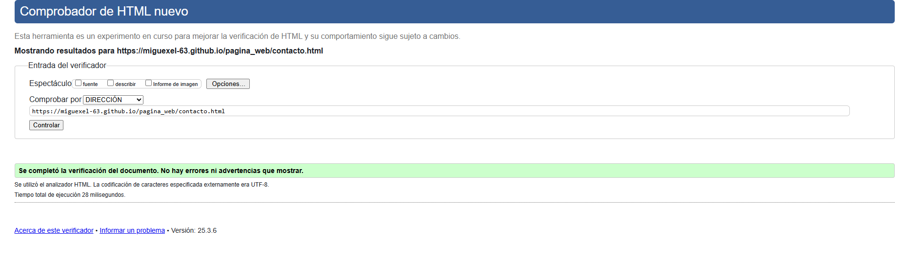

Descripción del Proyecto

BEYOND THE SIRENS
En la pagina puedes encontrar distintas informaciones sobre la policia de Estados Unidos como pueden ser noticias, un catalogo de equipamiento,opiniones y legislaciones que tienen relacion con la policia y una pagina para contactar con nosotros.

El objetivo de nuestra pagina web es poder dar a conocer a la gente de habla hispana mas información sobre la policia de Estados Unidos.

Hemos usado las siguientes tecnologias : HTML y CSS.

Hemos añadido enlaces a paginas internas nuestras y externas, tambien hemos puesto tablas con informacion relevante, formularios para mandarnos tanto texto como imagenes, ademas de usar adecuadamente las etiquetas del HTML correspondiente para una estructura 
adecuada y las etiquetas correspondiente para que sea semantica, ademas de usar el CSS para que la pagina sea mucho mas visual y responsiva.

No hemos hecho uso de ninguna plantilla

Se han sacado fragmentos de codigo HTML y de CSS de las siguientes paginas:
https://developer.mozilla.org/es/docs/Web/HTML
https://lenguajehtml.com/
https://desarrolloweb.com/home/html

Proceso de Subida al Hosting Gratuito

Para hacer la página accesible al público, hemos hecho estos pasos:

Elección del hosting gratuito: Se seleccionó GitHub Pages.

Configuración del dominio: Se utilizó https://miguexel-63.github.io/pagina_web/.

Subida de archivos:

Se subieron los archivos mediante el panel de control de ubuntu.

Capturas de Pantalla de Validación

A continuación, se presentan las capturas de pantalla de la validación de cada una de las páginas del proyecto. En cada imagen se puede ver la URL correspondiente:

Validación: Se ha usado para validar la pagina validator.w3.org.
